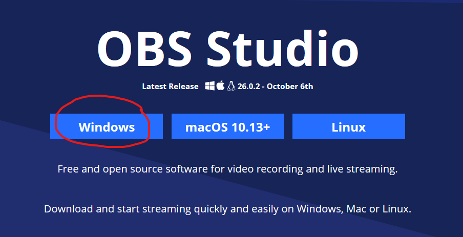

# How to ScreenShare for multible people on MS TEAMS

## Table of Contents

- [About](#about)
- [Getting Started](#getting_started)
- [Usage](#usage)
- [Contributing](../CONTRIBUTING.md)

## About <a name = "about"></a>

Since MS Teams doesn't support mutiple people sharing their screens and nobody really wants to just use a webcam to share their face or are conserned about recording the call if they do. We should instead use free and open source tool [OBS](https://obsproject.com/). There are many other software that are capble of doing "virtual webcam" just google this term if obs doesn't work or you want to use something else.

## Getting Started <a name = "getting_started"></a>

To get started you first will need to go download: [OBS](https://obsproject.com/).
And you will also need desktop version of [Teams](https://www.microsoft.com/en-us/microsoft-365/microsoft-teams/download-app)
I won't show you how to install MS Teams. :upside_down_face:

### Installing & Configuring

First download OBS by choosing windows, clicking on the installer and click next until it's installed.

Say what the step will be

```
Give the example
```

And repeat

```
until finished
```

End with an example of getting some data out of the system or using it for a little demo.

## Usage <a name = "usage"></a>

Add notes about how to use the system.
